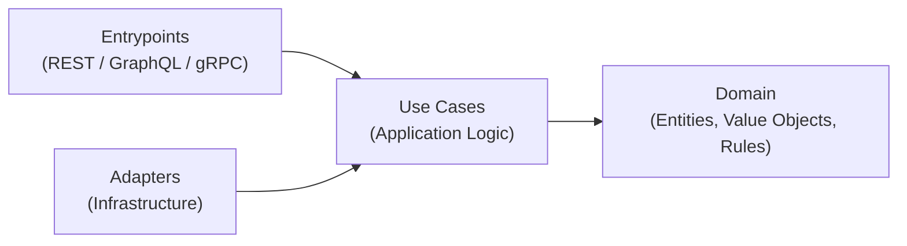

# payments-core

## Overview

**payments-core** is a production-shaped Python service that models the core lifecycle of a payment with a strong emphasis on **correctness under concurrency**, **idempotency**, **time-based rules**, and **explicit state machines**.

This project is intentionally designed as an interview-grade system: small in scope, but deep in engineering rigor. It focuses on the hardest parts of real payment systems—race conditions, transactional guarantees, and invariant enforcement—rather than breadth of features.

The service implements a **single-capture payment model** with authorization windows, idempotent capture requests, and strong guarantees under concurrent access.

---

## Goals

The primary goals of this project are:

* Model payment capture as a **finite state machine** with explicit transitions
* Guarantee **idempotent behavior** under retries and concurrent requests
* Enforce **time-based capture windows** safely and deterministically
* Demonstrate how to move from **in-memory correctness** to **transactional DB constraints**
* Use **Clean Architecture** to keep business rules isolated from infrastructure
* Be fully **dockerized**, reproducible, and easy to reason about

This project is also meant to serve as a reusable **practice framework** for senior-level backend interviews.

---

## Non-Goals (for v0)

* Refunds, chargebacks, disputes
* Multi-currency or FX handling
* Partial captures
* Cross-service sagas or orchestration
* External payment gateway integrations

---

## Core Concepts

### Payment State Machine

Payments move through a strict, explicit lifecycle:

* `pending` → `authorized`
* `authorized` → `captured`
* `authorized` → `failed`
* `captured` is terminal

Illegal transitions are rejected by design.

### Idempotency

* Each capture request requires an `idempotency_key`
* The pair `(payment_id, idempotency_key)` uniquely identifies a capture attempt
* Repeated requests with the same key **must return the same result**, even under concurrency

### Time-Based Rules

* Each authorized payment has a `capture_expires_at` timestamp
* Capture is allowed **only if DB time is strictly before this value**
* Database time is used as the single source of truth to avoid clock skew

---

## Concurrency & Correctness

The system is explicitly designed to handle the following race conditions:

1. **Same payment, same idempotency key, concurrent requests**
   → Exactly one capture record is created; all callers receive the same response.

2. **Same payment, different idempotency keys, concurrent requests**
   → At most one successful capture is allowed.

Correctness is achieved through a combination of:

* Explicit invariants
* Per-payment serialization (locks or DB row locking)
* Unique constraints for idempotency
* Transactional state transitions

---

## Data Model (Conceptual)

### Payments

Represents the current authoritative state of a payment.

Fields (conceptual):

* `id`
* `state` (`pending | authorized | captured | failed`)
* `authorized_at`
* `capture_expires_at`
* `captured_at`
* `captured_amount_cents`

### Captures

Represents an idempotent capture attempt.

Fields (conceptual):

* `id`
* `payment_id`
* `idempotency_key`
* `status`
* `amount_cents`
* `created_at`

Constraints:

* `UNIQUE(payment_id, idempotency_key)`

---

## Architecture

The project follows **Clean Architecture** principles:

* **Domain**: entities, value objects, invariants, state machine
* **Application**: use cases (e.g. `CapturePayment`), orchestration logic
* **Infrastructure**: database, repositories, time provider, locking mechanisms
* **Interfaces**: HTTP API layer (FastAPI or equivalent)

Business rules do not depend on frameworks, databases, or delivery mechanisms.



---

## Technology Stack

* **Language**: Python
* **Package management**: UV
* **API**: FastAPI (planned)
* **Database**: Relational (PostgreSQL planned)
* **Containerization**: Docker + Docker Compose
* **Testing**: pytest

All components are designed to run locally via Docker with zero host dependencies.

---

## Project Structure (Planned)

```
payments-core/
├── app/
│   ├── adapters/
│   ├── domain/
│   ├── entrypoints/
│   ├── infrastructure/
│   └── ports/
│   └── use_cases/
├── tests/
├── docker/
├── docker-compose.yml
├── pyproject.toml
└── README.md
```

---

## Development Approach

The project will be developed **incrementally by stages**, each accompanied by an **Architecture Decision Record (ADR)**.

Each stage will:

* Introduce one core concept (e.g. idempotency, DB constraints, time rules)
* Be reviewed and validated against invariants
* Preserve correctness guarantees from previous stages

This ensures the system evolves without regressions.

---

## Why This Project Exists

Payment systems are not hard because of syntax or frameworks—they are hard because **small correctness bugs create large financial and trust failures**.

This project exists to:

* Practice thinking in invariants and failure modes
* Demonstrate senior-level backend judgment
* Serve as a reusable reference for interviews and real-world design

---

## Dependency Management

Dependencies are managed with **[uv](https://docs.astral.sh/uv/)** and fully locked.

Workflow:

```bash
make lock
make sync
git add pyproject.toml uv.lock
git commit -m "update dependencies"
```

All environments (local, CI, production) install dependencies strictly from the lockfile.

---

## Status

🚧 **Work in progress** — project is intentionally built step by step.

Next step: **Stage 1 ADR — Core domain model & in-memory capture correctness**
